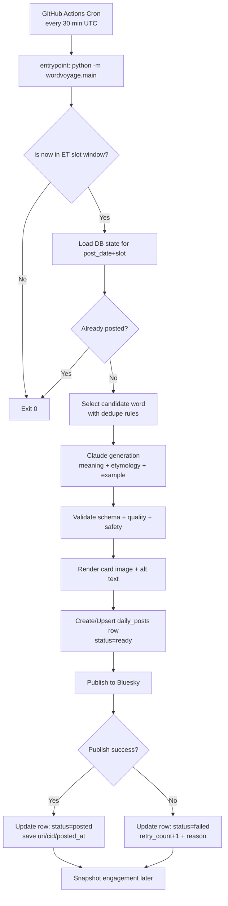

# WordVoyage Architecture (v1)

## Why Plain Python

Plain Python is the best default for v1 because WordVoyage is a scheduler-driven pipeline (not an always-on API product yet).

- Keep deploy surface small.
- Keep maintenance simple.
- Maximize shipping speed and reliability.

Add FastAPI only when you need external triggers or an operator dashboard.

## Runtime Flow

## Daily Slot Strategy (America/New_York)

- `main_reveal`: 1:00 PM to 2:00 PM ET
- `deep_dive`: 6:00 PM to 7:00 PM ET
- `quiz`: optional evening slot (for example 9:00 PM ET)

Important: evaluate with `America/New_York` timezone, not fixed EST, to handle DST automatically.

## Idempotency and Reliability

- One row per `post_date + slot` in `daily_posts`.
- `idempotency_key` blocks duplicate posts on retries.
- Safe reruns from GitHub Actions are expected behavior.
- If a run fails, keep `failed` state and retry in next scheduler tick.

## Data Design Notes

- `words` is reusable content inventory and dedupe anchor.
- `generation_runs` stores prompt/model/raw I/O for debugging and quality tuning.
- `daily_posts` is operational truth (planned -> posted or failed).
- `engagement_snapshots` captures growth over time for viral analysis.

